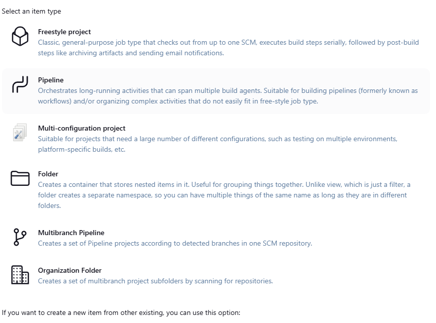

# Jenkins Pipeline 🚀

  

Welcome to the **Jenkins Pipeline** repository! This project demonstrates how to set up and execute a Jenkins pipeline for seamless **Continuous Integration (CI)** and **Continuous Deployment (CD)**.

## What is CI/CD?

**CI/CD** is a set of practices that enable developers to deliver code changes frequently, reliably, and automatically. Here's a simple breakdown:

- **Continuous Integration (CI):** Automatically test and integrate code changes into the main branch whenever a developer pushes new code.
- **Continuous Deployment (CD):** Automatically deploy integrated code to production or staging environments after it passes all tests.

Together, CI/CD ensures faster development cycles and higher code quality.

---

## Features of this Repository

- Example Jenkinsfile for pipeline automation
- Clear steps for setting up Jenkins pipelines
- Integrated CI/CD process workflow
- Scalable and reusable pipeline stages

---

## Alternatives to Jenkins

While Jenkins is a popular choice for CI/CD, there are other tools available, including:

- **GitHub Actions:** A powerful CI/CD tool integrated directly into GitHub, perfect for repository-based workflows.
- **GitLab CI/CD:** A robust and integrated CI/CD solution built into GitLab, with support for advanced pipelines and containerized jobs.
- **AWS CodeBuild:** A fully managed CI/CD service provided by AWS for building and testing code.
- **Travis CI:** A cloud-based CI/CD platform known for its ease of integration and support for open-source projects.

---

## Benefits of Using Jenkins

1. **Open Source:** Jenkins is completely free and open source, making it accessible to everyone.
2. **Highly Customizable:** With over 1,800 plugins, Jenkins can integrate with virtually any tool or technology.
3. **Scalability:** Supports distributed builds across multiple servers to handle large-scale projects.
4. **Wide Community Support:** A large, active community ensures ongoing development, support, and troubleshooting resources.
5. **Cross-Platform:** Jenkins is platform-independent and can run on various operating systems like Windows, Linux, and macOS.

---

## Project Types in Jenkins

Jenkins supports multiple types of projects to suit a variety of workflows and requirements. Below is an overview of the key project types:

1. **Freestyle Project:** A general-purpose project that supports simple tasks like building and testing software.
2. **Pipeline Project:** Used for defining complex build and deployment pipelines using code written in a `Jenkinsfile`.
3. **Multi-Configuration Project:** Suitable for running builds across different configurations (e.g., environments or platforms).
4. **Folder Project:** Organize multiple jobs into folders for better project management.
5. **Multibranch Pipeline:** Automatically creates pipelines for each branch in a source control repository.
6. **Organization Folder:** Automatically scans and manages repositories in an organization (e.g., GitHub or Bitbucket) and creates pipelines for them.

  

> The above image shows the Jenkins project creation page, where you can choose from various project types based on your requirements.

---

## Contributions

Feel free to fork this repository and make contributions! All ideas and improvements are welcome.

